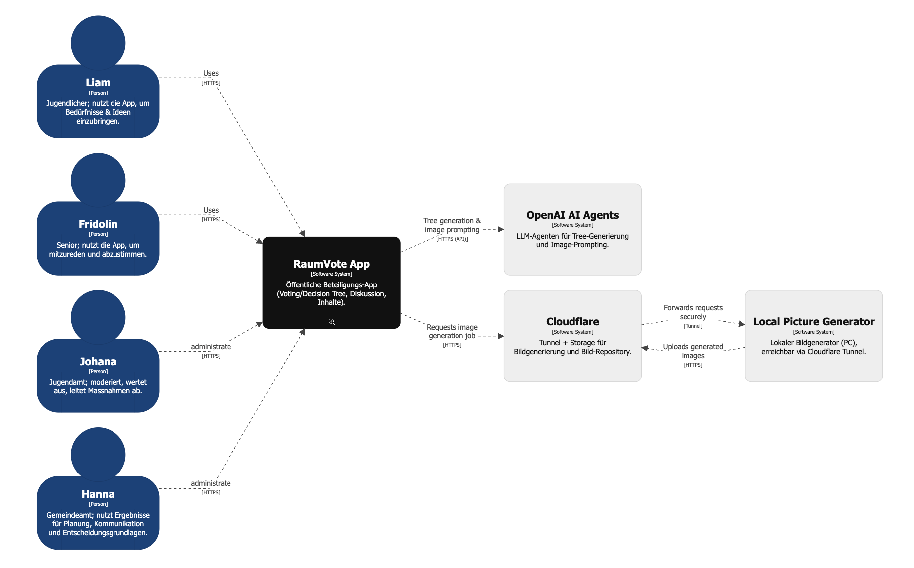
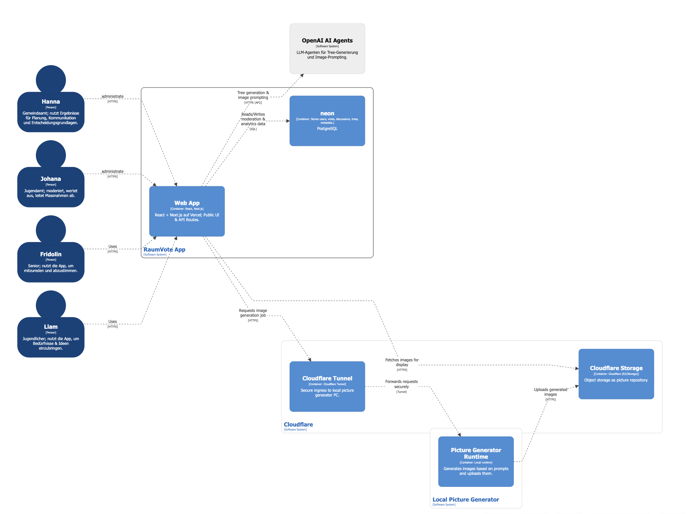

# RaumVote – Digitale Jugendbeteiligung für öffentliche Räume

## 1. Projektkontext

### Ausgangslage
In einer Toggenburger Gemeinde bestehen Nutzungskonflikte im öffentlichen Raum zwischen Jugendlichen und anderen Anspruchsgruppen. Jugendliche fühlen sich verdrängt, während Anwohnende Lärm und Unsicherheitsgefühle beklagen. Repressive Sofortmassnahmen (z. B. Abbau von Sitzbänken) führten lediglich zu einer Problemverlagerung.

### Problemstellung
Jugendliche – insbesondere jene ohne Vereins- oder politische Anbindung – sind in formellen Planungsprozessen kaum vertreten. Ihre Bedürfnisse nach Begegnung, informellem Aufenthalt und Mitgestaltung bleiben unberücksichtigt.

### Zielsetzung
Entwicklung eines digitalen, jugendgerechten Beteiligungsformats, das:

- zeit- und ortsunabhängig nutzbar ist  
- anonym und datenschutzkonform funktioniert  
- digitalen Austausch ermöglicht  
- Beteiligungsergebnisse anschlussfähig für kommunale Planungsprozesse macht  

**RaumVote** ist die prototypische Umsetzung dieses Beteiligungsansatzes.

---

## 2. Vision & Value Proposition

### Why
Jugendliche erhalten ein niederschwelliges, digitales Sprachrohr zur Mitgestaltung öffentlicher Räume.

### How
Mobile-first Voting-App mit interaktiven Entscheidungsbäumen sowie Diskussions- und Feedbackfunktionen.

### What
Ein datenschutzkonformes Beteiligungstool für Gemeinden mit Fokus auf Jugendpartizipation.

RaumVote verbindet Design-Thinking-Prinzipien  
(Empathize → Define → Ideate → Prototype → Test)  
mit einer real implementierten Webanwendung.

---

## 3. Systemarchitektur (C4-Übersicht)

### Level 1 – System Context

#### Akteure
- Jugendliche (z. B. „Liam“, 14) – stimmen ab, bringen Ideen ein  
- Senior:innen – diskutieren und bewerten  
- Jugendarbeit – moderiert  
- Gemeindeverwaltung – nutzt Ergebnisse für Planung  

#### Externe Systeme
- OpenAI AI Agents – Generierung von Entscheidungsbäumen und Bild-Prompts  
- Cloudflare – Tunnel & Storage  
- Lokaler Picture Generator – KI-Bildgenerierung  

---

### Level 2 – Container

| Container            | Technologie               | Zweck                    |
|----------------------|--------------------------|--------------------------|
| Web App              | Next.js 16, React 19     | UI & API Routes          |
| Database             | PostgreSQL (Neon)        | Persistenz               |
| Cloudflare Storage   | R2                       | Bild-Repository          |
| Picture Generator    | Local Runtime            | Generiert Bilder via Prompt |

#### Architekturprinzipien
- Mobile-first  
- Privacy-by-Design  
- API-zentriert  
- Klare Trennung von UI, Logik und Persistenz  

---

## 4. Technischer Stack

- **Frontend:** React 19 + Next.js 16 (App Router)  
- **Backend:** Next.js API Routes  
- **ORM:** Prisma 7  
- **Database:** Neon PostgreSQL  
- **Authentication:** Token-basierter Zugang via QR-Code  
- **Hashing:** SHA-256 mit `VOTER_PEPPER`  
- **Deployment:** Vercel (App), Cloudflare (Tunnel & Storage)  

---

## 5. Kernkonzept: Entscheidungsbäume

Das Beteiligungsformat basiert auf einem **binären Decision Tree**  
(`public/tree.active.json`).

### Struktur
- `Nodes` → Binäre Fragen  
- `Options` → Antwortoptionen mit Bild  
- `Leaf` → Abstimmbares Endergebnis  

### Vorteile
- Gamifizierte Navigation (Swipe-Logik)  
- Niedrige Einstiegshürde  
- Strukturierte Ideensammlung  

---

## 6. Datenschutz & Identitätskonzept

RaumVote folgt einem **Privacy-First-Ansatz**:

- Zugang via vorerstellte UUID-Token  
- Token wird lokal gespeichert (`localStorage`)  
- Server speichert nur `voterHash` (SHA-256 mit Pepper)  
- Keine Speicherung von Roh-Token in Votes oder Kommentaren  

### Prinzipien
- Pseudonymisierung  
- Minimaldatenspeicherung  
- DSGVO-orientierte Architektur  

---

## 7. API-Design

Alle API-Routen folgen diesem Muster:

1. Token validieren  
2. `voterId` hashen  
3. Prisma Query ausführen  
4. JSON-Response zurückgeben  

### Beispielendpunkte

- `POST /api/vote` – Vote toggeln  
- `GET /api/vote/status` – Aktuellen Vote prüfen  
- `POST /api/like` – Like toggeln  
- `GET /api/results` – Aggregierte Ergebnisse  
- `GET /api/auth/validate` – Tokenvalidierung  
- `POST /api/admin/tokens` – Token-Management  

---

## 8. UX-Konzept

- TikTok-ähnliche Swipe-Navigation  
- ActionRail mit Like / Vote / Comment  
- Bottom-Sheet-Kommentare  
- Fixe Tabbar (64px Layoutkonvention)  
- Deutsche UI-Texte  

### Ziel
Maximale Niederschwelligkeit für digital-affine Jugendliche.

---

## 9. Entwicklungsprozess

RaumVote wurde im Rahmen einer Design-Thinking-Blockwoche entwickelt.

### Phasen

1. Empathize – Persona-Analyse (z. B. 14-jähriger Schüler)  
2. Define – Problemraum klären  
3. Ideate – Beteiligungsansatz konzipieren  
4. Prototype – Web-App entwickeln  
5. Test – Feedback & Iteration  

### Arbeitsweise

- Scrum-Rollen (Product Owner, Scrum Master, Dev Team)  
- Sprintzyklen  
- Pitch-Präsentation mit Vision & Reflexion  

---

## 10. Betrieb & Setup

    npm run dev
    npm run build
    npm run lint
    npx prisma migrate dev --name <name>
    npx prisma generate

### Environment-Variablen

    DATABASE_URL=
    DIRECT_URL=
    VOTER_PEPPER=
    ADMIN_SECRET=

---

## 11. Beitrag zur Gemeindeentwicklung

RaumVote unterstützt folgende Beteiligungsstufen:

- Information  
- Mitreden  
- Mitentscheiden  
- Mitwirken  

Das Tool kann in zukünftigen Entwicklungsprojekten adaptiert werden  
(z. B. Spielplätze, Verkehr, Freiräume).

Es bildet eine digitale Brücke zwischen:

- Jugend  
- Verwaltung  
- Planung  
- Öffentlichkeit  

---

## 12. Fazit

RaumVote ist ein prototypischer, technisch implementierter Lösungsansatz für digitale Jugendbeteiligung im öffentlichen Raum.

Es kombiniert:

- Design Thinking  
- Gamifizierte Entscheidungslogik  
- Datenschutzorientierte Architektur  
- KI-gestützte Inhaltsgenerierung  
- Praxisrelevanz für kommunale Planung  

Damit adressiert das Projekt sowohl soziale als auch technologische Aspekte digitaler Transformation in Gemeinden.
